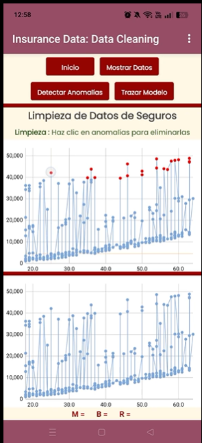

# 📊 Insurance Cost Predictions App
Aplicación móvil desarrollada en MIT App Inventor para análisis, depuración y predicción de costos de seguros médicos mediante regresión lineal e integración con IA.

  

📑 Tabla de Contenidos
Descripción General

Características Principales

Dataset

Arquitectura de la Aplicación

Modelo Matemático

Retos Técnicos y Soluciones

Conclusiones

Tecnologías Utilizadas

Estructura del Proyecto

Autor

🚀 Descripción General
Esta herramienta analítica permite examinar cómo influyen variables biométricas y demográficas (edad, BMI, tabaquismo) en el costo de una póliza de seguro médico.

La aplicación:

Consume datos en tiempo real desde Google Sheets

Ejecuta limpieza de datos atípicos

Traza la línea de mejor ajuste

Genera predicciones financieras con apoyo de IA

✨ Características Principales
🔐 Autenticación (Screen0)
Validación de credenciales y control de acceso.

🧭 Navegación Modular (Screen1)
Panel centralizado para acceder a cada etapa analítica.

🧹 Depuración de Datos (cleanDataScreen)
Filtrado de anomalías y registros inconsistentes.

📈 Modelado Matemático (drawLOBFscreen)
Cálculo dinámico de:

Pendiente (M)

Intersección (B)

Coeficiente de correlación (R)

🤖 Predicciones e IA (makePredictionsScreen)
Evaluación de escenarios en tiempo real con chatbot integrado.

📂 Dataset
Fuente: Kaggle — Medical Cost Personal Datasets (Miri Choi)  
Integración: Google Sheets
Muestra: 300 registros representativos

Variables Clave
Variable	Descripción
age	Edad del usuario
bmi	Índice de Masa Corporal
charges	Prima del seguro
smoker	Indicador de tabaquismo

🛠️ Arquitectura de la Aplicación
text
[Screen0: Login] ──> [Screen1: Menú Principal]
                           ├──> [cleanDataScreen: Limpieza de Datos]
                           ├──> [drawLOBFscreen: Modelo Matemático]
                           └──> [makePredictionsScreen: Predicciones e IA]
🧮 Modelo Matemático
Se utiliza un modelo de Regresión Lineal:

Código
Y_estimada = M * X + B
Y_estimada: Costo proyectado

X: Edad o BMI

M: Pendiente

B: Intersección

R: Confiabilidad del ajuste

🛠️ Retos Técnicos y Soluciones
1️⃣ Optimización del Datagrid y Visualización
Desafío: Renderizar 1,338 registros saturaba el lienzo y generaba latencia.
Solución: Reducir la muestra a 300 registros para trazados limpios y ejecución fluida.

2️⃣ Compatibilidad Numérica
Desafío: Diferencias entre separadores decimales (punto/coma).
Solución: Normalización con replace all text y conversión explícita a número.

3️⃣ Depuración de Anomalías
Desafío: Registros nulos o atípicos afectaban las métricas del modelo.
Solución: Algoritmo de Data Cleaning previo al cálculo de la regresión.

📌 Conclusiones
✔️ Viabilidad Técnica
MIT App Inventor demostró capacidad para:

Conectarse a la nube

Depurar datos

Calcular modelos estadísticos

Integrar IA

✔️ Impacto Biométrico
Se confirma correlación positiva entre:

BMI

Edad

Incremento en primas

💻 Tecnologías Utilizadas
MIT App Inventor 2

Google Sheets

CSV Parsing

Bloques de lógica y matemáticas

UI/UX con Poppins-Regular.ttf y paleta pastel

📁 Estructura del Proyecto
Código
src/      → Archivo fuente (.aia)
assets/   → Tipografías, vectores e imágenes
docs/     → Capturas, diagramas y documentación
👤 Autor
María Fernanda Sánchez Alvarez  
Desarrollo e Implementación
